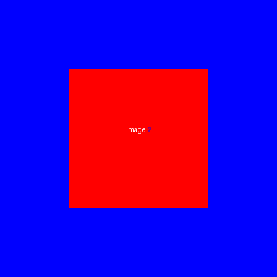

# Image Difference Utility

## Description

This utility provides a simple way to compare two images (expected and actual screenshots) and generates a third image highlighting the differences with a purple overlay. It's designed to help quickly identify visual discrepancies in automated testing environments or for manual verification purposes.

## Installation

```bash
pip install -r requirements.txt  
```

Clone this repository or copy the `image_comparer.py` file into your project's `utils` directory.

## Usage

To use the `ImageDifference` class in your project, follow these steps:

1. Import the class from the `image_comparer.py` file.
2. Instantiate the class with paths to your expected and actual images.
3. Call the `generate_difference_image` method with the path where you want the difference image saved.

Example:

```python
from tests.tests import ImageDifference

expectation = 'path/to/expected_screenshot_001.png'
actual = 'path/to/actual_screenshot_001.png'
difference = 'path/to/output_difference.png'

image_diff = ImageDifference(expectation, actual)
image_diff.generate_difference_image(difference)
```

## Example

Below are examples of an expected screenshot, an actual screenshot, and the generated difference image output by the utility.

### Expected Screenshot


### Actual Screenshot


### Difference Image

The differences are highlighted in purple.



## Contributing

Contributions to improve the utility are welcome. Please follow the standard pull request process to submit improvements or bug fixes.

